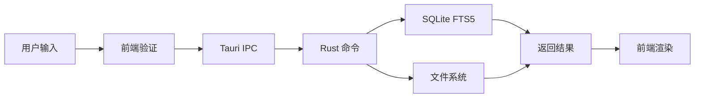
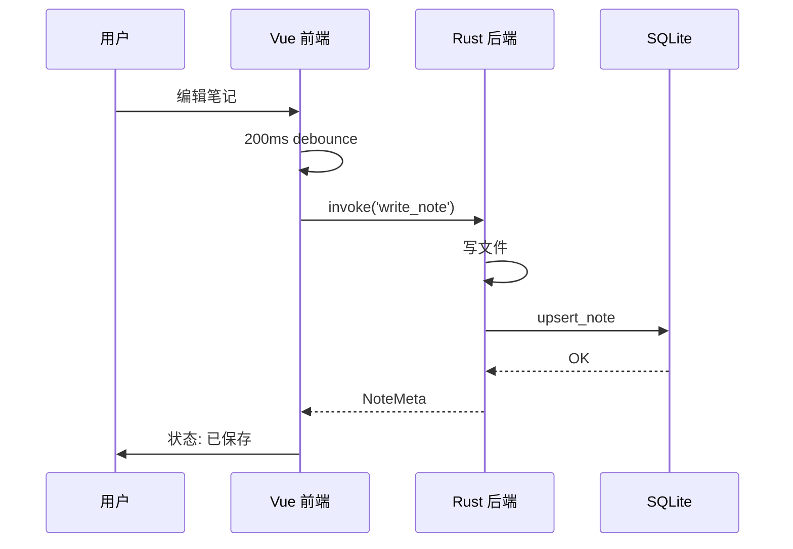
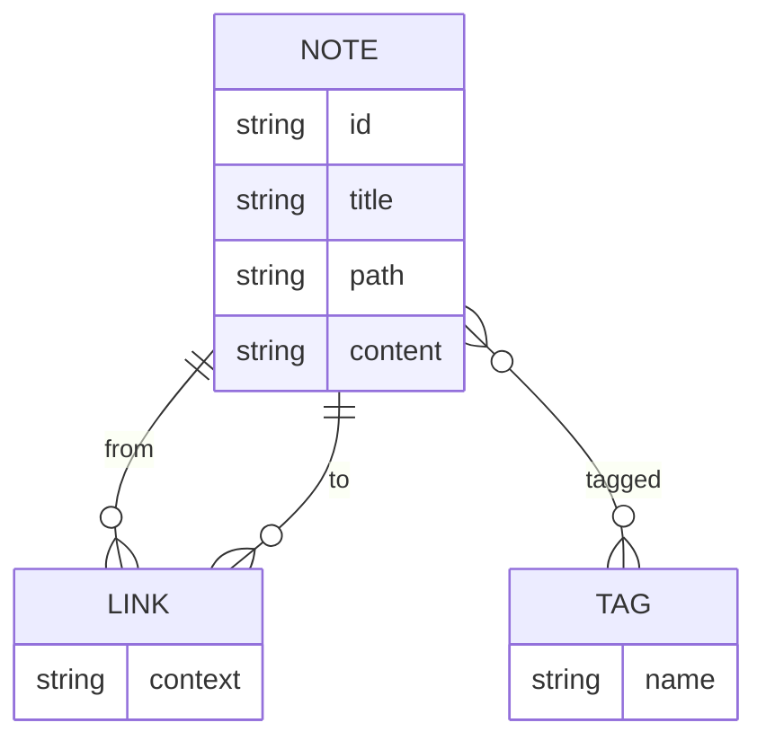

# 渲染能力 Showcase

> 这篇笔记用来测试 Shiki 代码高亮、Mermaid 图表、行内代码等功能。所有内容都可以在右边预览实时看到。

## 代码块

支持 30+ 主流语言，自动从语言 ID 推断。试试点击右上角「**复制**」按钮。

### Rust

```rust
fn main() {
    let mut v = vec![1, 2, 3];
    v.push(4);
    println!("{:?}", v);

    // 闭包 + 迭代器
    let sum: i32 = v.iter().sum();
    println!("sum = {}", sum);
}
```

### TypeScript

```typescript
interface User {
  id: number
  name: string
  tags: string[]
}

async function fetchUser(id: number): Promise<User> {
  const res = await fetch(`/api/users/${id}`)
  if (!res.ok) throw new Error(`HTTP ${res.status}`)
  return res.json()
}
```

### Python

```python
from dataclasses import dataclass
from typing import Iterable

@dataclass
class Point:
    x: float
    y: float

    def distance_to(self, other: 'Point') -> float:
        return ((self.x - other.x) ** 2 + (self.y - other.y) ** 2) ** 0.5

points: list[Point] = [Point(0, 0), Point(3, 4)]
for p in points:
    print(f"({p.x}, {p.y})")
```

### SQL

```sql
SELECT n.title, n.path, COUNT(l.id) AS link_count
FROM notes n
LEFT JOIN links l ON l.from_note_id = n.id
WHERE n.tags LIKE '%rust%'
GROUP BY n.id
ORDER BY link_count DESC
LIMIT 10;
```

### Bash

```bash
# 找最近 7 天修改过的笔记
find ~/vault -name "*.md" -mtime -7 -type f | xargs grep -l "TODO"
```

## 行内代码

行内代码也美化过了：`const x = 42`、`<div class="x">`、`Promise<User>`、调用 `fetchUser(123)` 这样的。

试试带路径的：`./src-tauri/src/commands/notes.rs` 这样的。

## Mermaid 图表

### 流程图



### 时序图



### 实体关系



## 表格 + 列表 + 引用

| 状态 | 任务 | 优先级 |
|---|---|---|
| ✅ | CodeMirror 编辑器 | P0 |
| ✅ | Shiki 高亮 | P0 |
| ✅ | Mermaid 图表 | P0 |
| 🔄 | 反向链接 | P1 |
| ⏳ | 间隔重复 | P1 |

- [x] 写完这篇 showcase
- [ ] 给 [[Rust 所有权]] 加上图示
- [ ] 整理代码片段库

> **注意**：复制代码块时复制的是纯文本，不会带颜色 span。点击预览区右上角的「复制」按钮即可。

## 闪卡示例

`#card` 标记的问答会被识别为闪卡（间隔重复功能准备好后自动出现）：

- 所有权三规则是什么？ #card
  - 每个值有唯一所有者；离开作用域值被丢弃；同一时刻仅一个所有者。
- 为什么 Rust 不需要 GC？ #card
  - 编译期通过所有权系统追踪值的使用，超出作用域自动 drop。

---

# 关联

- [[P2 链接网络 Showcase]] — 演示反向链接、块引用、悬停预览
